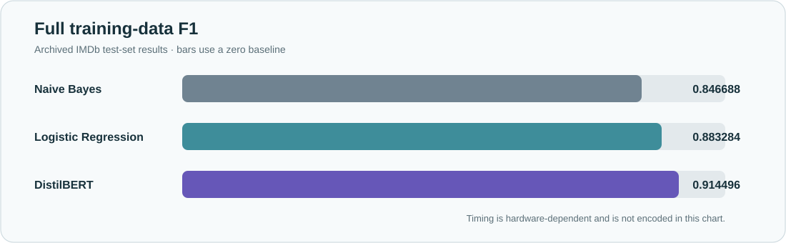

<p align="center">
  
</p>

<p align="center">
  
  
  
  
</p>

# Machine Learning Research Archive

An archive of completed machine-learning experiments, currently centered on an IMDb sentiment-classification study with traditional baselines, DistilBERT, data-scale experiments, and exploratory error analysis.

[Quick Start](#quick-start) · [At a Glance](#at-a-glance) · [Results Snapshot](#results-snapshot) · [Featured Project](#imdb-sentiment-analysis) · [Repository Structure](#repository-structure) · [Scope and Limitations](#scope-and-limitations)

## Quick Start

| Goal | Open |
|---|---|
| Understand the study | [IMDb project README](IMDb-Sentiment-Analysis/README.md) |
| Inspect the experiment workflow | [IMDb notebook](IMDb-Sentiment-Analysis/notebooks/IMDb_sentiment_analysis.ipynb) |
| Review archived metrics and figures | [Results directory](IMDb-Sentiment-Analysis/results) |
| Check limitations and proposed work | [Project limitations](IMDb-Sentiment-Analysis/README.md#additional-project-limitations) · [Future work](IMDb-Sentiment-Analysis/README.md#future-work-proposed-not-implemented) |

The IMDb dataset is not redistributed. Rerunning the notebook requires a separately downloaded dataset and a compatible local Python/CUDA environment.

## At a Glance

| Item | Archived study |
|---|---|
| Task | Binary sentiment classification |
| Dataset | IMDb Large Movie Review Dataset — 25,000 train / 25,000 test reviews |
| Models | Multinomial Naive Bayes · Logistic Regression · DistilBERT |
| Best full-data F1 | **0.914496** — DistilBERT |
| Training-data study | 20% · 50% · 100% |
| Error pool | **5,465** test reviews misclassified by at least one evaluated model |
| Status | Completed and archived |

## Results Snapshot

Full training-data setting:

| Model | F1 |
|---|---:|
| TF-IDF + Naive Bayes | **0.846688** |
| TF-IDF + Logistic Regression | **0.883284** |
| DistilBERT | **0.914496** |

<p align="center">
  
</p>

These values are read from the archived formal result CSV. Timing values are hardware-dependent: the traditional models ran on CPU and DistilBERT used CUDA acceleration.

## IMDb Sentiment Analysis

A completed comparison of sparse traditional baselines and DistilBERT, covering predictive performance, computational cost, training-data scale, and exploratory error patterns. See the [complete project README](IMDb-Sentiment-Analysis/README.md) for research questions, model settings, full results, error-analysis boundaries, reproducibility notes, and proposed extensions.

## Repository Structure

```text
Machine-Learning/
├── IMDb-Sentiment-Analysis/
│   ├── notebooks/            archived experiment workflow
│   ├── results/              exported metrics, tables, and figures
│   ├── docs/assets/          project-level presentation asset
│   └── README.md             complete project record
├── docs/assets/              archive-level presentation assets
├── .gitignore
└── README.md
```

## Tools Used

Python · Jupyter Notebook · pandas · NumPy · scikit-learn · PyTorch · Hugging Face Transformers · Matplotlib

## Scope and Limitations

- This is a completed research archive, not an actively developed software product.
- The IMDb dataset is not redistributed in this repository.
- The 5,465-review error pool is the union of reviews misclassified by at least one model; it is not a count of DistilBERT-only errors.
- The 210 representative error examples use a balanced inspection design and do not estimate the natural category distribution of the full error pool.
- Rule-based error categories are exploratory, and the archived study has no multi-seed statistical analysis.
- Timing comparisons are practical hardware-dependent measurements, not hardware-neutral benchmarks.
- Difficulty taxonomies, cost-adaptive routing, selective prediction, and other extensions remain proposed and were not implemented.
